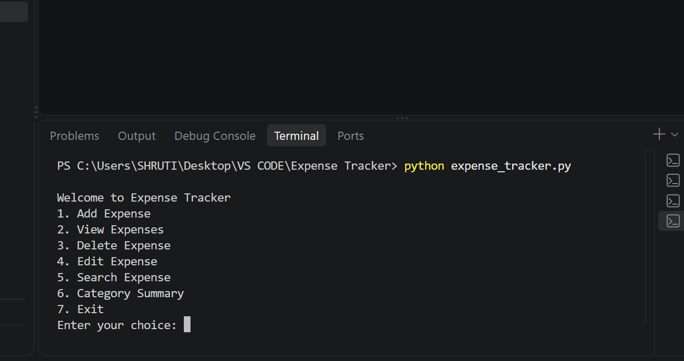

# Expense Tracker

A Python-based expense management application that uses SQLite for persistent data storage.

## Features

- Add expenses
- View all expenses
- Edit expenses
- Delete expenses
- Search expenses by category
- Category-wise expense summary
- Automatic date recording
- Input validation
- Persistent SQLite database storage

## Technologies Used

- Python
- SQLite
- SQL

## Database

The application uses SQLite to store expense information.

The `expenses` table contains:

- ID
- Amount
- Category
- Description
- Date

## How to Run

1. Make sure Python is installed.
2. Open the project folder in VS Code.
3. Run:

```bash
python expense_tracker.py

## Project Screenshot

